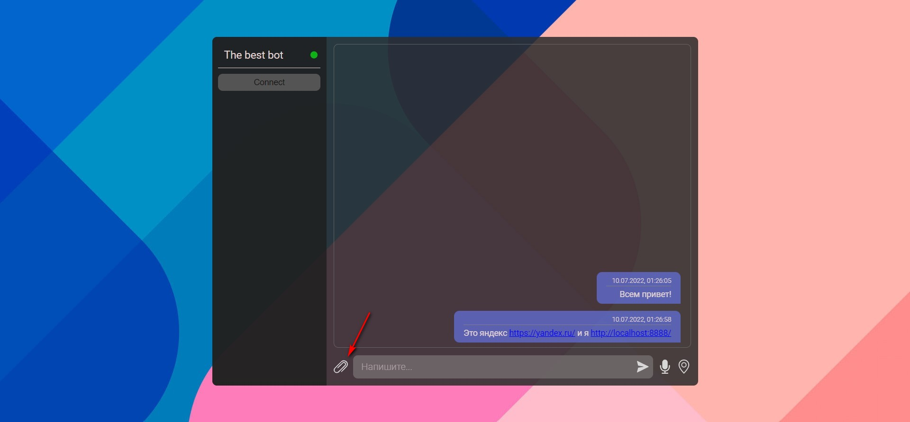
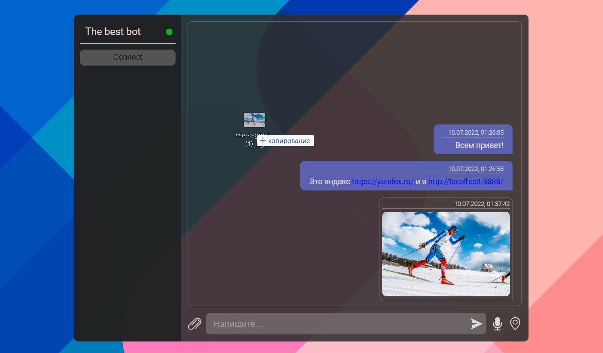
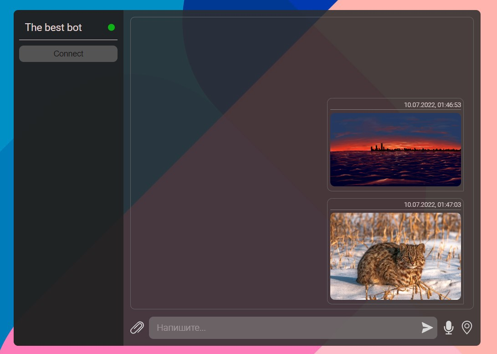
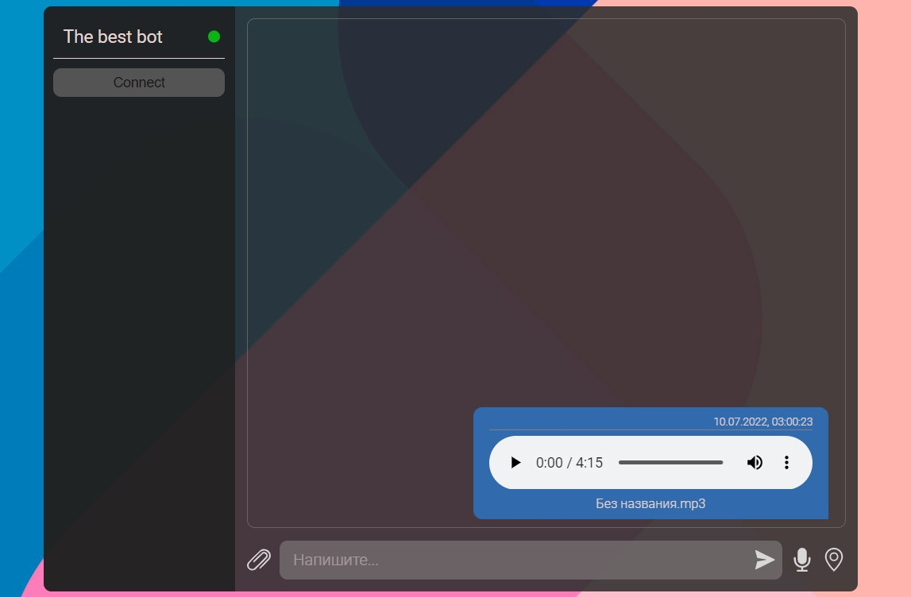
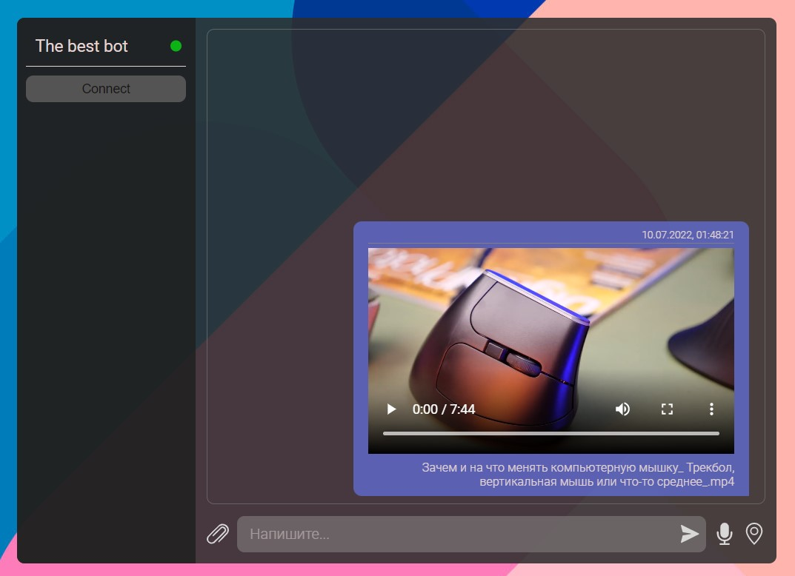
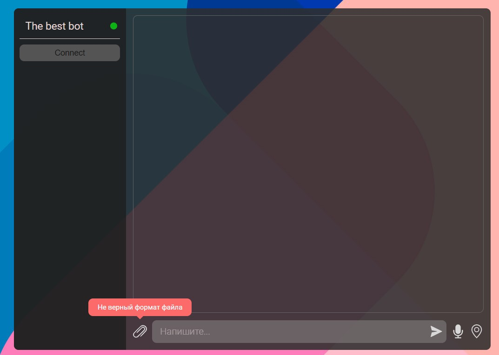
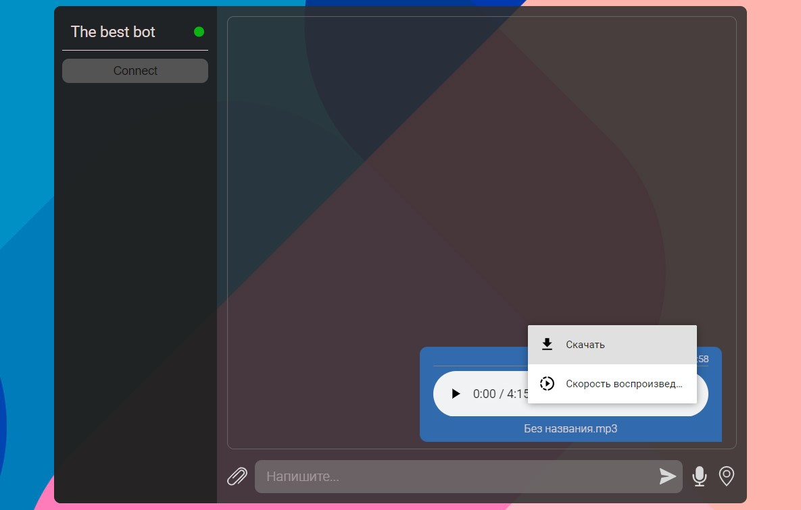

[GitHub Pages](https://lekseff.github.io/Bot_Frontend/)

## Дипломная работа по курсу "Продвинутый JavaScript"

Здесь представлен бот, который предназначен как для хранения информации в виде текстовых сообщений, изображений, аудио и видео файлов. Также бот имеет интеграцию с несколькими сервисами API. Он может получать погоду используя Ваше местоположение, новости, курсы таких валют как доллар(USD), евро(EUR), Bitcoin(BTC).

- Подключение к серверу происходит автоматически. При успешном подключении показывается зеленый индикатор и кнопка 'Connect' не активна. Если произойдет отключение цвет индикатора изменится на красный и кнопка станет активной. Можно пробовать подключиться нажатием на кнопку. (Возможно Вам повезет)
- При подключении нескольких ботов сообщения будут видны всем участникам. Сообщения команд, геолокация и ответы на эти команды видны только отправившему их участнику. Также они не сохраняются в истории.
- Бот сохраняет сообщения на сервере. Если в тексе имеются ссылки они дополнительно выделяются. Отправка сообщения возможна по клавише 'Enter' или при клике на иконку отправить. При подключении к серверу происходит загрузка последних 10 сообщений из истории. 
- По мере просмотра ленты сообщений они автоматически подгружаются с сервера.
- Для загрузки доступны файлы изображений, аудио и видео. Загрузить файлы можно по кнопке загрузить(скрепка) или перетащив файл в область сообщений. 
  Загрузка через DnD:  Изображения:  Аудио файлы:  Видео файлы:  Если загрузка файла не поддерживается появится сообщение об ошибке: 
 - Чтобы скачать файл необходимо выбрать сохранить.Если это изображение то достаточно кликнуть по нему и откроется окно выбора места сохранения.
  

## Геолокация
